# Oracle 23ai Vector Search

## 🎯 **Objetivos**

Demonstrar de forma prática como utilizar a funcionalidade de busca vetorial do Oracle 23c AI Vector Search.

O que você aprenderá:

- Criar e configurar um banco de dados autônomo (Autonomous Database) no Oracle Cloud Infrastructure (OCI).
- Utilizar a funcionalidade de busca vetorial para otimizar consultas e análises em PDFs.
- Explorar as vantagens do Oracle 23c AI na integração de dados relacionais e semânticos.

>### ⚠️ **ATENÇÃO**:
>
>Antes de continuar, realize o download dos arquivos abaixo.
> 
> 
>- **Download dos PDFs**: Qualquer PDF pode ser utilizado, mas, para fins didáticos deste workshop utilizaremos como nosso exemplo o guia de [Normas Ambientais da Marinha](https://www.marinha.mil.br/sites/default/files/atos-normativos/dpc/normam/normam-401.pdf)
>- **Download da Aplicação**: [Aplicação APEX](https://objectstorage.us-ashburn-1.oraclecloud.com/p/giVj_Pu_1DNcojoKoLWZnEbL2oqQANGFCEGCuIE8Mm1hRaXCMhUkkKdu4xqi9CjB/n/idi1o0a010nx/b/bucket-prodesp/o/f102.sql)

### _**Aproveite sua experiência na Oracle Cloud!**_

## 📌 Introdução

>**Com o Oracle 23c AI, o AI Vector Search integra vetores ao Oracle Database, eliminando bancos especializados e evitando a fragmentação de dados. Essa tecnologia permite buscas por similaridade combinadas com SQL simples, potencializando modelos de linguagem (LLMs) com contexto adicional. Inclui novo tipo de dado vetorial, índices específicos e extensões SQL para análises avançadas diretamente no banco de dados.** 

Referência: [Announcing Oracle Database 23ai : General Availability
](https://blogs.oracle.com/database/post/oracle-23ai-now-generally-available)

### ➡️ **O que é Vector Database?**

> Um banco de dados vetorial é qualquer banco de dados que pode armazenar e gerenciar embeddings vetoriais de forma nativa e lidar com os dados não estruturados que eles descrevem, como documentos, imagens, vídeos ou áudios.

### ➡️ **Como o Oracle AI Vector Search revoluciona a busca de dados semânticos no Oracle Database?**

> O Oracle AI Vector Search permite criar tabelas com o novo tipo de dado VECTOR, armazenando vetores diretamente no banco de dados. É possível inserir vetores com INSERT, carregar dados usando SQL Loader ou Data Pump, e criar índices para otimizar buscas em embeddings. Novas funções SQL, como as de cálculo de distância vetorial, facilitam a análise de vetores, enquanto operadores adicionais permitem criar, converter e descrever vetores, além de realizar chunking e embeddings de dados de forma eficiente.

### ➡️ **Como o Oracle APEX revoluciona o desenvolvimento de aplicações no Oracle Database?**

>**O Oracle APEX (Application Express) é uma plataforma de desenvolvimento low-code que permite a criação rápida e fácil de aplicações seguras, escaláveis e altamente responsivas diretamente no Oracle Database, sem a necessidade de infraestrutura complexa.** 

> Com o Oracle APEX, desenvolvedores podem criar aplicações empresariais modernas por meio de uma interface intuitiva que combina design visual, componentes integrados e funcionalidades avançadas, como gráficos interativos, relatórios dinâmicos e dashboards. O APEX aproveita as capacidades nativas do Oracle Database, como segurança, alta disponibilidade e desempenho, permitindo a criação de workspaces, o upload de aplicações e a integração com serviços externos via credenciais e APIs. Com poucos cliques, é possível importar arquivos SQL, configurar parâmetros de segurança e realizar customizações rápidas e eficientes.

 

### **Recursos e Suporte**:

- **Documentação da Oracle Cloud**: [Getting started with vectors in 23ai](https://blogs.oracle.com/coretec/post/getting-started-with-vectors-in-23ai)
- **Tutoriais**: [Oracle Database 23ai - Oracle AI Vector Search & Retrieval Augmented Generation (RAG) with Oracle APEX](https://www.linkedin.com/pulse/oracle-database-23ai-ai-vector-search-retrieval-augmented-rao-bqkcf/)

### _**Aproveite sua experiência na Oracle Cloud!**_

## 1️⃣ Validação de Região

Faça o login no Oracle Cloud Infrastructure (OCI) e valide se a região de Chicago se encontra disponível para uso.

   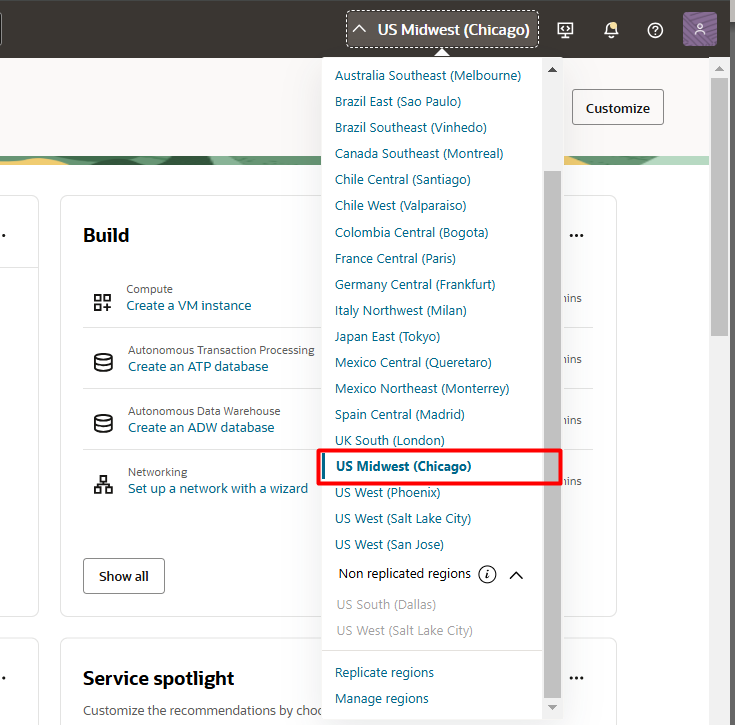

## 2️⃣ Criação de Autonomous Database

Clique no menu **(☰)** e selecione **Database ⮕ Autonomous Data Warehouse**.

Verifique se está no compartimento **root**. Faça a criação do serviço **somente** neste compartimento.

> **ATENÇÃO**: Antes de continuar verifique se está no compartimento **ROOT** conforme indicado abaixo.

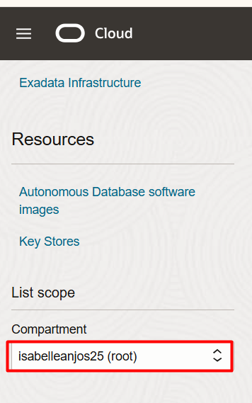

Na página de gestão de Autonomous Databases, clique em **Create Autonomous Database**.
  

Escolha a versão 23ai para o banco de dados:

Utilize a senha recomendada: **WORKSHOPsec2019##** . Selecione **secure access from everywhere** e clique em **Create Autonomous Database**:

> **ATENÇÃO**: Verifique se utilizou a senha recomendada **WORKSHOPsec2019##**

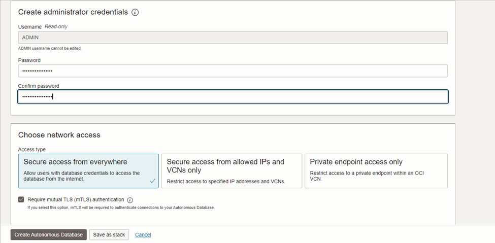

Vá para o próximo laboratório.

> **Status do Autonomous Database:**
>  
>  
> - Ícone amarelo = Em criação; 
> - Ícone verde = Pronto para uso;

## 3️⃣ Configurando o Autonomous Database

Quando o serviço estiver com o ícone verde, clique no em **Database Actions ⮕ SQL**:

Feche todos os tutoriais que aparecerão na página.
 

Em seguida, **copie, cole e execute os comandos abaixo conforme indicado na imagem**:

    <copy>  
        --Criação de credencial
    BEGIN
        DBMS_CLOUD.CREATE_CREDENTIAL(
            credential_name => 'OBJ_STORE_CRED',
            username => 'oracleidentitycloudservice/CAIO.OLIVEIRA@ORACLE.COM',
            password => 'teste'
        );
    END;
    /

    --Download de Modelo onnx do object storage para diretorio autonomous
    begin
    dbms_cloud.get_object(
        credential_name => 'OBJ_STORE_CRED'
        , object_uri => 'https://objectstorage.sa-saopaulo-1.oraclecloud.com/p/nS9blF5U2ETiZT7YKZ_zrXtPOEH2Xf22TbdlpK99xZIEPmZedx4_eFBX4khYykmw/n/idi1o0a010nx/b/TDC/o/intfloatmodelsmall.onnx'
        , directory_name => 'DATA_PUMP_DIR'
        , file_name => 'intfloatmodelsmall.onnx'
    );
    end;
    /

    --Criação de usuário/schema para import do modelo e criação da aplicação
    create user demo identified by "WORKSHOPsec2019##";
    grant dwrole to demo;
    grant unlimited tablespace to demo;
    grant read, write on directory data_pump_dir to demo;

    --Import de modelo onnx para autonomous
    EXECUTE dbms_vector.load_onnx_model('DATA_PUMP_DIR', 'intfloatmodelsmall.onnx', 'demo.doc_model', JSON('{"function" : "embedding", "embeddingOutput" : "embedding" , "input": {"input": ["DATA"]}}'));
    commit;

    </copy>

Execute conforme indicado abaixo:

## 4️⃣ Criação de Workspace e Import de aplicação em ambiente APEX

Para acessar a URL da instância APEX na Console do Oracle Cloud Infrastructure (OCI), siga os passos a seguir. 

Inicialmente, retorne ao console da OCI. Em seguida, navegue até a página do seu Autonomous Database. Dentro da página da instância do banco de dados, localize e clique na opção **"Tool Configuration"**. Lá, você encontrará a URL da instância APEX. **Copie essa URL e abra em seu navegador.**

   

Na página que será aberta ao acessar a URL da instância APEX, **insira a senha de acesso ao workspace admin**, criada na etapa anterior (**WORKSHOPsec2019##**).
 

   

Em seguida, clique na opção **Create Workspace**. Na tela seguinte, escolha a opção **Existing Schema** para continuar com a criação do workspace utilizando um schema já existente.

   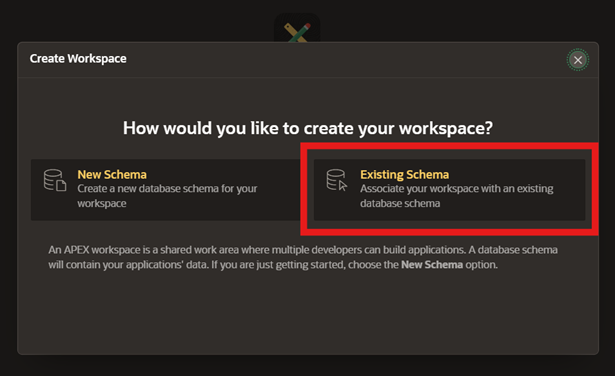

Na sequência, clique no ícone **(☰)** na tela e selecione **DEMO**. 
 
Em seguida, preencha o formulário como o exemplo abaixo (recomendamos a senha **WORKSHOPsec2019##**). E clique em **Create Workspace** para finalizar.

> **ATENÇÃO**: Verifique se utilizou a senha recomendada **WORKSHOPsec2019##**

   

Clique na aba superior **Manage Instance** e, em seguida, selecione **Security**.

   

Altere o parâmetro **Allow Public File Upload** para **Yes** e clique em **Apply Changes** para salvar as alterações.

   

Encerre a sessão do usuário **ADMIN** clicando em **Sign Out**, localizado na região superior direita da tela.

   

Faça o login no usuário **DEMO** criado nas etapas anteriores utilizando as credenciais de acesso indicadas abaixo.

> **ATENÇÃO**: Verifique se utilizou a senha recomendada **WORKSHOPsec2019##**

   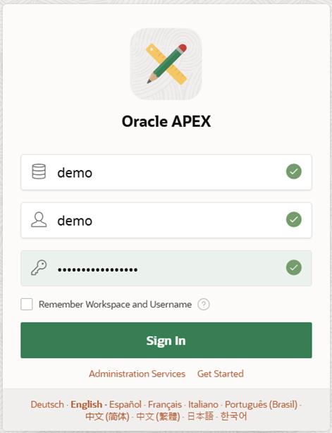

Clique em **App Builder** e, em seguida, selecione **Import**.

   

Na página que será aberta, faça o upload do arquivo **f102.sql**, cujo download está no seguinte link: [f102.sql](https://objectstorage.us-ashburn-1.oraclecloud.com/p/giVj_Pu_1DNcojoKoLWZnEbL2oqQANGFCEGCuIE8Mm1hRaXCMhUkkKdu4xqi9CjB/n/idi1o0a010nx/b/bucket-prodesp/o/f102.sql).

> **ATENÇÃO:** Caso já tenha sido realizado o download no início do tutorial, não é necessário realizar novamente.

   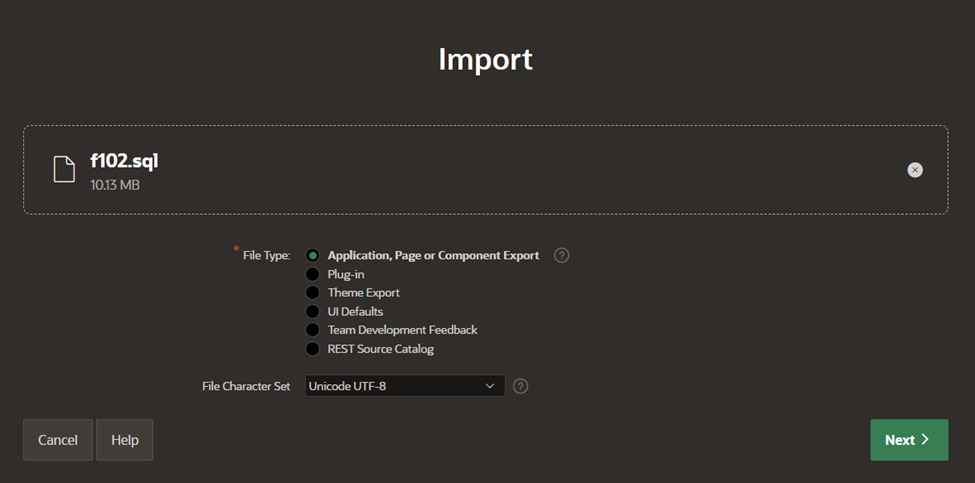

Clique em **Next:**

   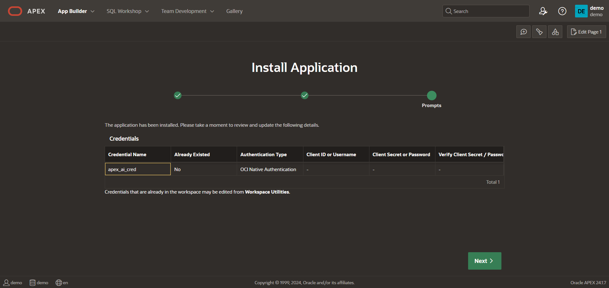

Aceite as configurações padrão e clique em **Install Application** para prosseguir com a instalação.

   

Clique em **Install Supporting Objects** para concluir a instalação dos objetos de suporte necessários.

   

Por fim, clique na aba **App Builder** para retornar à interface principal de desenvolvimento de aplicações.

   

## 5️⃣ Configuração de Credenciais para RAG (Retrieval-Augmented Generation)

Na aba **App Builder**, clique em **Workspace Utilities** para acessar as ferramentas utilitárias do workspace.

   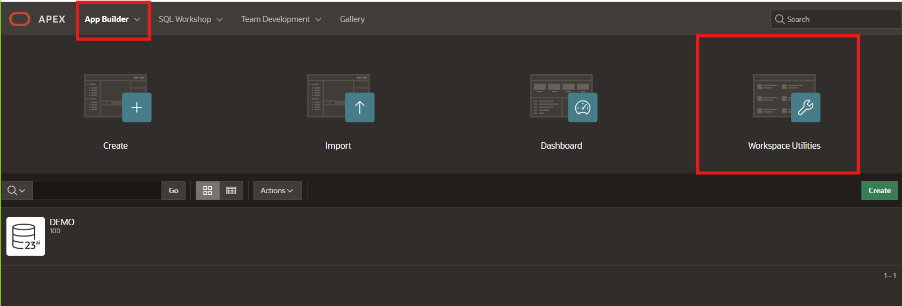

Em seguida, selecione **Web Credentials** e clique na credencial existente chamada **apex\_ai\_cred**.

   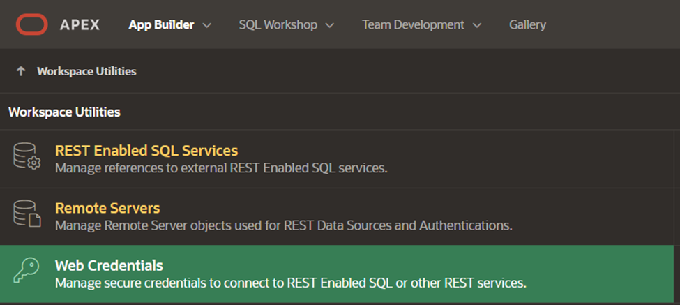
   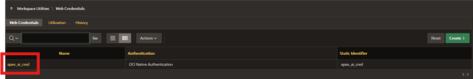

Para preencher corretamente essa credencial, é necessário obter algumas informações sobre o usuário no ambiente OCI. Na guia do navegador onde o OCI está aberto, clique no avatar no canto superior direito e selecione **User Settings**.

   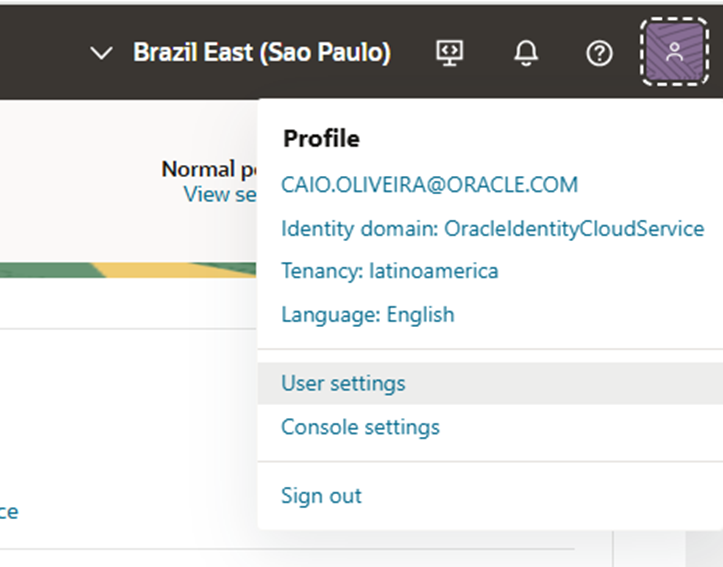

Na tela **User Settings**, localize a guia **API Keys** no canto inferior esquerdo. Clique nela e siga as instruções do assistente (wizard) para criar um par de chaves de API. 

> **ATENÇÃO: Certifique-se de fazer o download das chaves em um local seguro, pois será necessária para configurar a credencial na próxima etapa. Após o dowload, certifique-se de clicar em ADD para criar a chave**
> 
   

O preenchimento do formulário no APEX exigirá informações específicas que podem ser obtidas na tela do OCI. Para facilitar, **utilize as seguintes correspondências de cores** entre os dois sistemas. Preencha as seguintes informações:
- **OCI User ID** (Coletado no Configuration File Preview)
- **OCI Public Key Fingerprint** (Coletado no Configuration File Preview)
- **OCID Tenancy** (Coletado no Configuration File Preview)
- **OCI Private Key** (Abra o arquivo **.pem** cujo download foi realizado em um bloco de notas e copie o conteúdo)

Caso você tenha fechado a página com os dados, clique nos **três pontos** em **API Keys** ao lado direito do fingerprint e clique em **View Configuration File**

   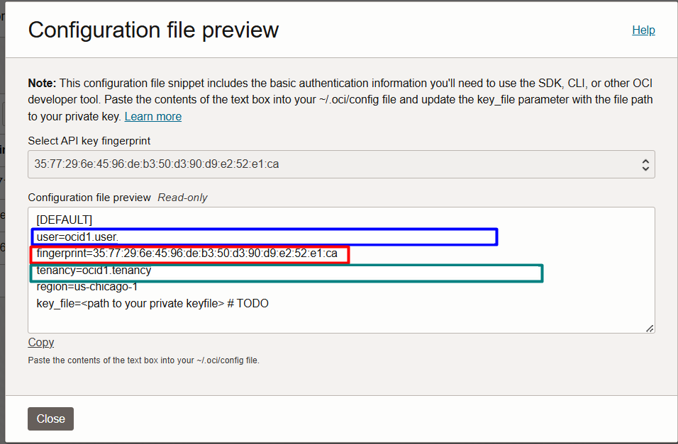
   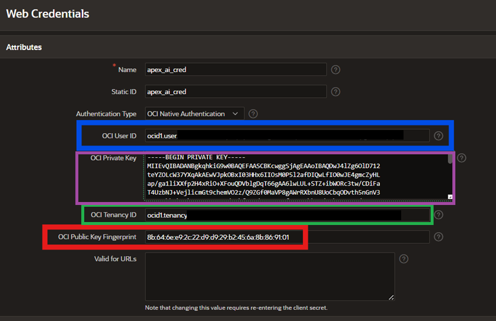

Por fim, clique em **Apply Changes** para salvar as configurações e concluir o ajuste da credencial.

## 6️⃣ Configuração no Payload da API de Requisição

Para concluir este processo, será necessário realizar uma alteração no **payload da API de requisição**.

Acesse o **App Builder** e clique na aplicação que você instalou recentemente.

   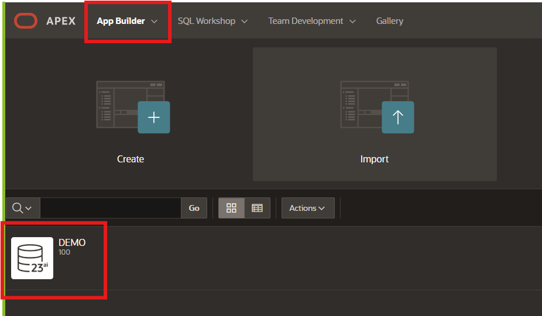

Selecione em **Shared Components ⮕ REST Data Resources**

   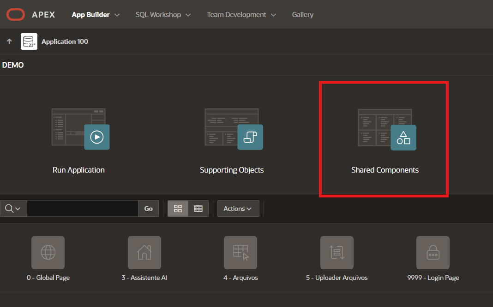
   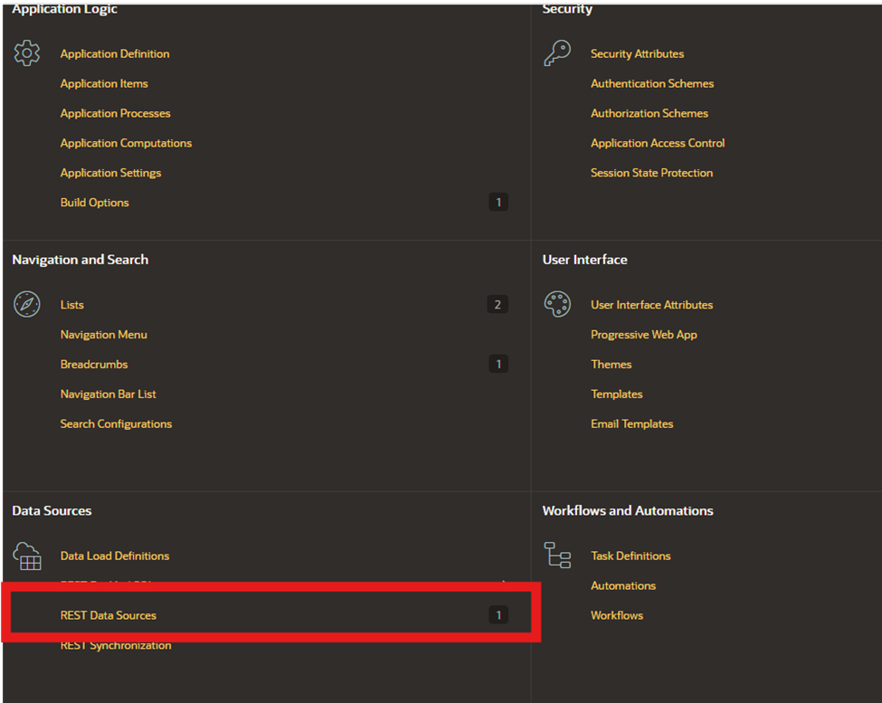

Clique em **cohere-chat** e, em seguida, no **ícone de lápis ao lado do método POST**.

   

**Altere o Compartment ID para a variável OCI Tenancy ID coletada na etapa 2 deste laboratório.**
Por fim, clique em **Apply Changes** para salvar as alterações.

   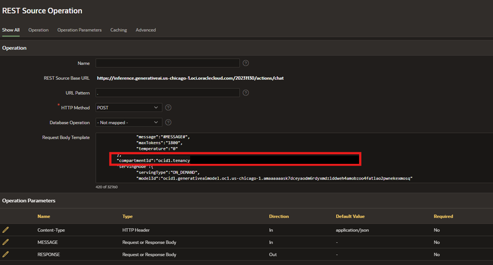

## 7️⃣ Teste da Aplicação

Com a configuração da credencial concluída, podemos testar a aplicação. Para isso, clique em **App Builder** e, em seguida, no ícone **Run** para executar a aplicação e verificar seu funcionamento.

   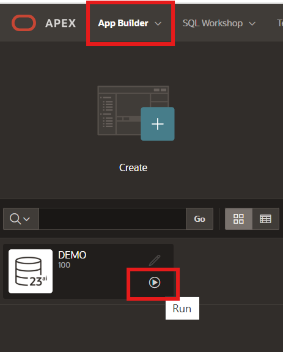

Clique no ícone **(☰)** e selecione a aba **Arquivos e Normas**.

   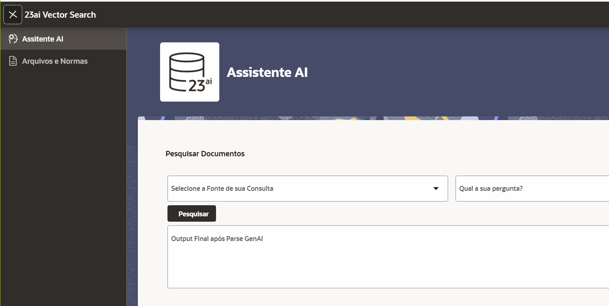

Seguiremos com o upload de um arquivo PDF para dentro da aplicação. Qualquer PDF pode ser utilizado, mas, para fins didáticos deste workshop utilizaremos como nosso exemplo o guia de [Normas Ambientais da Marinha](https://www.marinha.mil.br/sites/default/files/atos-normativos/dpc/normam/normam-401.pdf)

 
Clique em **Upload** e preencha o formulário seguindo o exemplo fornecido. O **JSON** utilizado para o preenchimento está disponível logo abaixo da imagem de referência.

   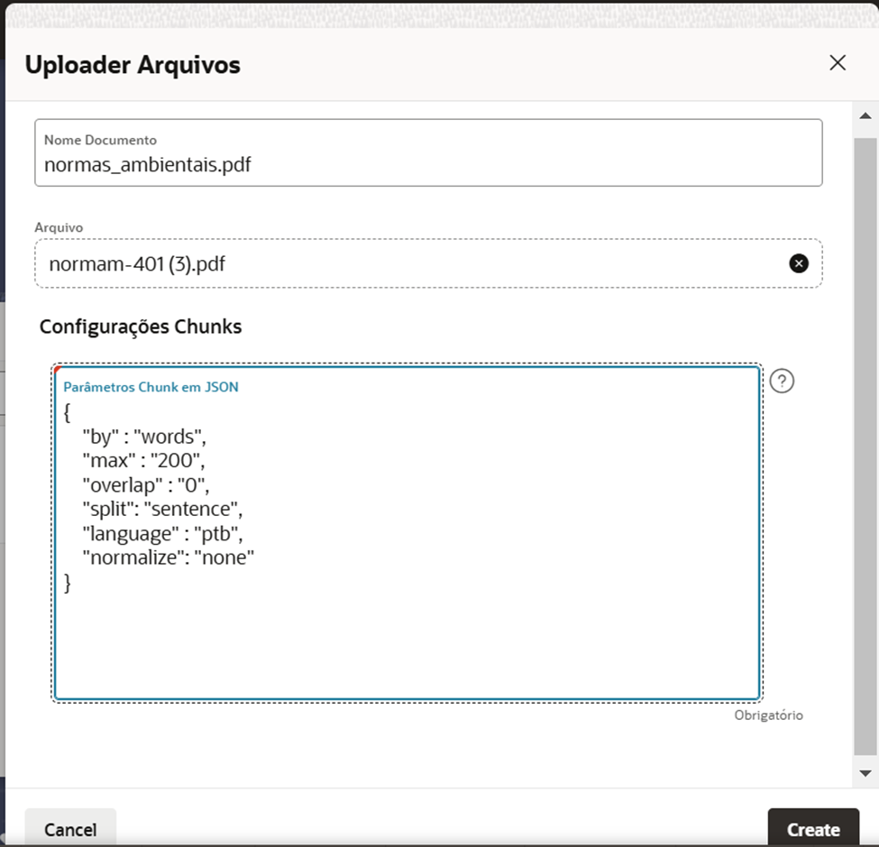

    <copy>  
    {
    "by" : "words",
    "max" : "200",
    "overlap" : "0",
    "split": "sentence",
    "language" : "ptb",
    "normalize": "none"
    }

    </copy>

Se o upload for concluído com sucesso, sua tela deverá se assemelhar ao exemplo exibido, mostrando a confirmação do arquivo enviado e os detalhes preenchidos no formulário.

   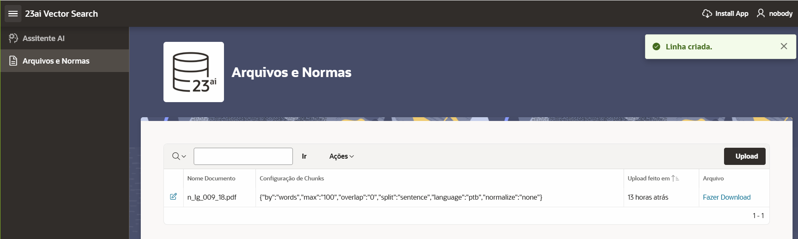

Clique em Assistente AI e faça uma pergunta relacionada ao documento carregado. 
 
Por exemplo, você pode perguntar: **COMO TROCAR ÁGUA DE LASTRO?**

   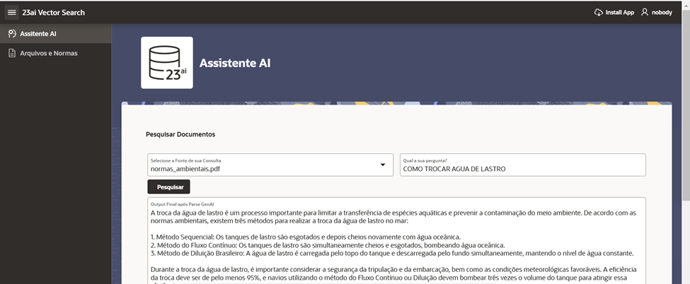

**Se não houver erro, você terá concluído com sucesso o workshop.** Sinta-se à vontade para fazer o upload de outros arquivos ou explorar realizando novas perguntas ao Assistente AI.

## 👥 Agradecimentos

- **Autores** - Caio Oliveira
- **Autores Contribuintes** - Isabelle Anjos, Gabriela Miyazima, Aristotelles Serra
- **Última Atualização Por/Data** - Janeiro 2025

## 🛡️ Declaração de Porto Seguro (Safe Harbor)

O tutorial apresentado tem como objetivo traçar a orientação dos nossos produtos em geral. É destinado somente a fins informativos e não pode ser incorporado a um contrato. Ele não representa um compromisso de entrega de qualquer tipo de material, código ou funcionalidade e não deve ser considerado em decisões de compra. O desenvolvimento, a liberação, a data de disponibilidade e a precificação de quaisquer funcionalidades ou recursos descritos para produtos da Oracle estão sujeitos a mudanças e são de critério exclusivo da Oracle Corporation.

Esta é a tradução de uma apresentação em inglês preparada para a sede da Oracle nos Estados Unidos. A tradução é realizada como cortesia e não está isenta de erros. Os recursos e funcionalidades podem não estar disponíveis em todos os países e idiomas. Caso tenha dúvidas, entre em contato com o representante de vendas da Oracle. 
