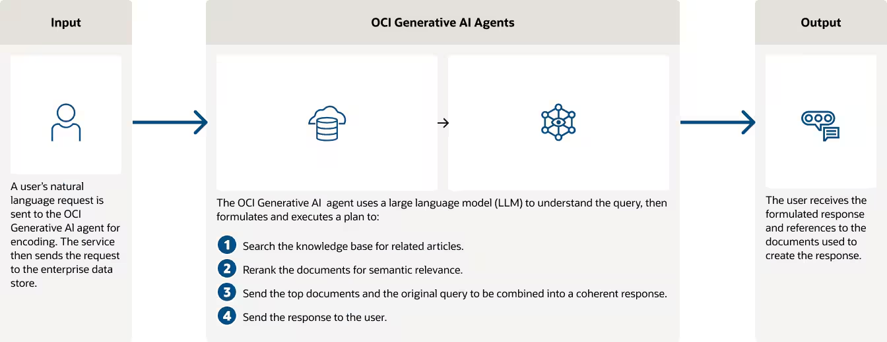
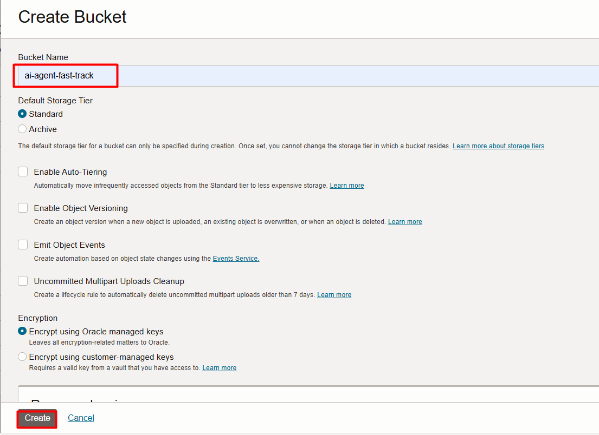
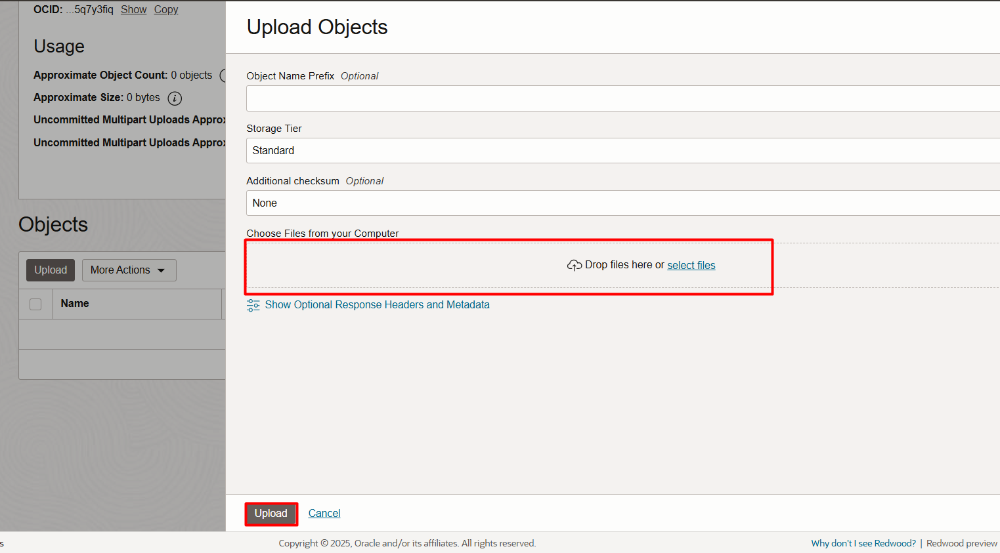
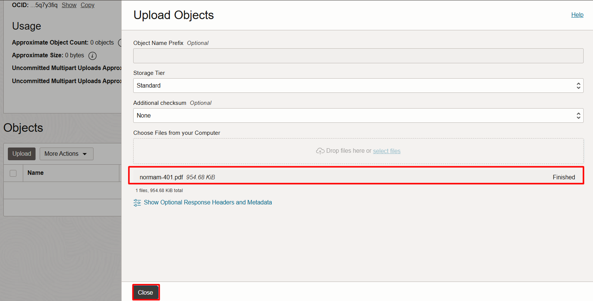
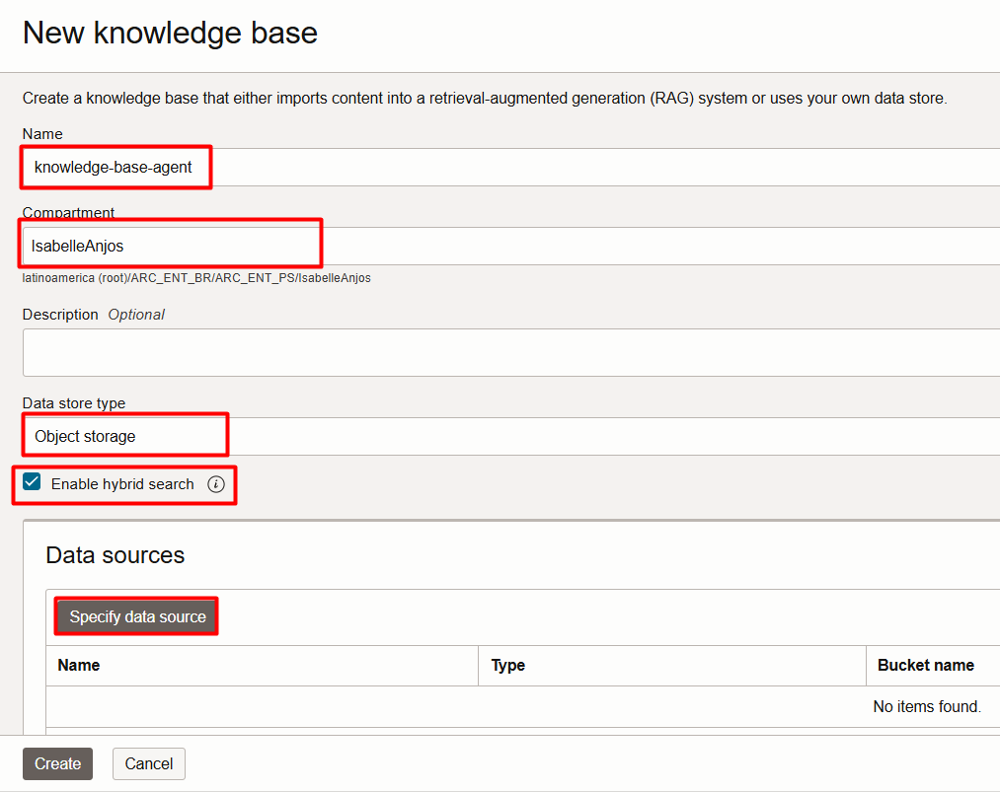
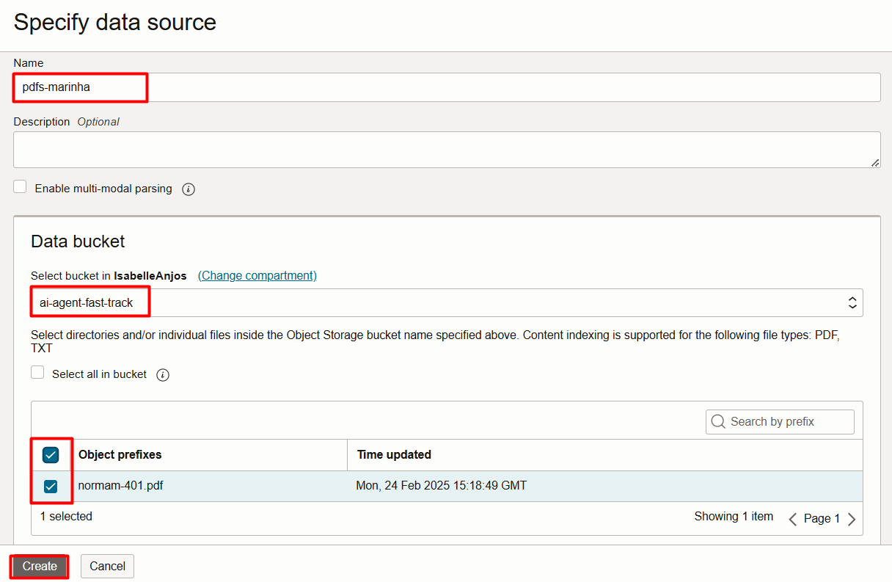
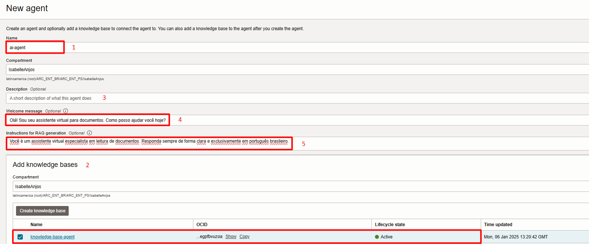
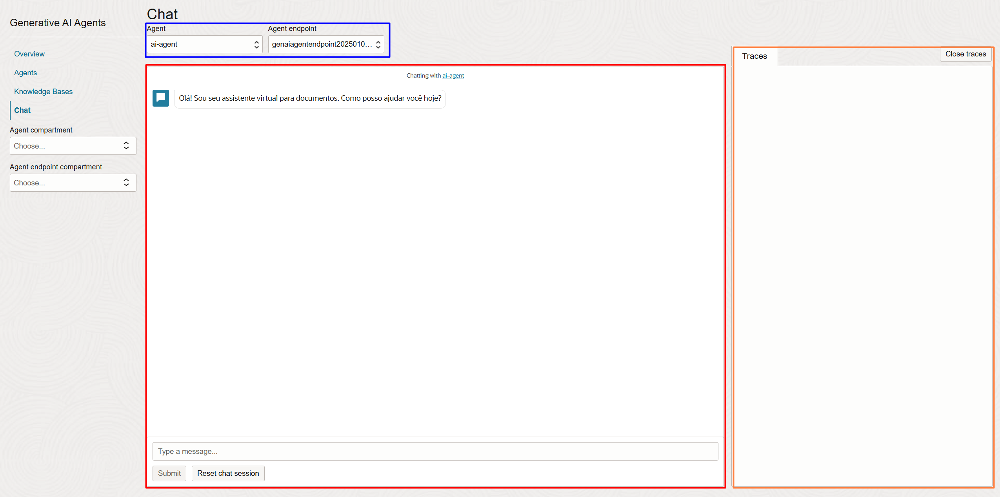
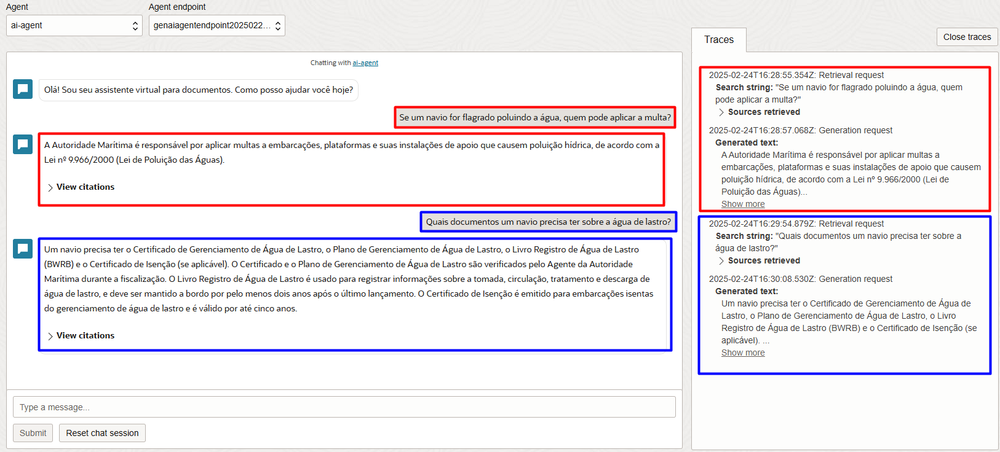
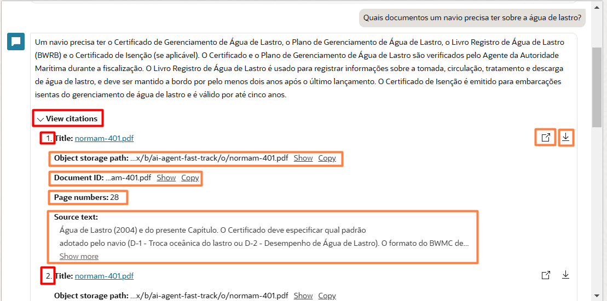

# Oracle Generative AI Agents

## 🎯 **Objetivos**

Descubrir como utilizar de forma prática a funcionalidade de busca vetorial do Oracle Generative AI Agents para otimizar consultas em documentos no formato PDF.

O que você aprenderá:

- Criar buckets no Object Storage e realizar o upload de documentos PDF.
- Configurar e utilizar o serviço OCI Generative AI Agent para criar bases de conhecimento e agentes conversacionais.
- Explorar como implementar a funcionalidade de Retrieval-Augmented Generation (RAG) para consultar documentos personalizados com eficiência e contexto.

>### ⚠️ **ATENÇÃO**:
>
>Antes de continuar, realize o download dos arquivos abaixo.
><br>
><br>
>- **Download dos PDFs**: Qualquer PDF pode ser utilizado, mas, para fins didáticos deste workshop utilizaremos como nosso exemplo o guia de [Normas Ambientais da Marinha](https://www.marinha.mil.br/sites/default/files/atos-normativos/dpc/normam/normam-401.pdf)

### _**Aproveite sua experiência na Oracle Cloud!**_

## 📌 Introdução

>**O OCI Generative AI Agents é um serviço avançado que combina o poder dos grandes modelos de linguagem (LLMs) com técnicas de recuperação inteligente, permitindo que organizações desenvolvam agentes virtuais capazes de fornecer respostas contextuais e precisas ao consultar suas bases de conhecimento.** 


Referência: [Generative AI Agents](https://www.oracle.com/br/artificial-intelligence/generative-ai/agents/)

### ➡️ **Recursos principais**
Com funcionalidades avançadas, o OCI Generative AI Agents oferece uma experiência poderosa e eficiente.
- **Integração de dados e canais de interação:** Suporte a chat e API, facilitando a interação entre usuários e agentes.  
- **Respostas contextualmente relevantes:** As respostas são geradas com base em consultas inteligentes à base de conhecimento, garantindo precisão e contexto.  
- **Pesquisa híbrida:** Combina métodos léxicos e semânticos para alcançar maior assertividade nas respostas.  
- **Moderação de conteúdo:** Garante interações seguras e respeitosas com controles para entrada e saída de dados.  
- **Conversas multi-turn:** Permite que usuários façam perguntas de acompanhamento, com respostas que levam em conta o histórico da conversa.  
- **Interpretação de elementos visuais:** Capacidade de interpretar gráficos e tabelas em PDFs sem necessidade de descrições adicionais.  
- **Hiperlinks automáticos:** Os links presentes nos documentos são automaticamente extraídos e incluídos nas respostas.  


### ➡️ **Como o OCI Generative AI Agents revoluciona a interação com bases de conhecimento?**

O serviço transforma a forma como os agentes interagem ao:  

- **Aumentar a transparência e a rastreabilidade:** Cada resposta pode ser vinculada à sua fonte original, garantindo responsabilidade.  
- **Garantir atualizações contínuas:** Bases de conhecimento podem ser atualizadas sem interromper o funcionamento do agente.  
- **Oferecer escalabilidade e segurança:** Arquitetura robusta que suporta cargas crescentes sem comprometer a integridade dos dados.

### **Recursos e Suporte**:

- **Documentação da Oracle Cloud**: [Generative AI Agents](https://docs.oracle.com/pt-br/iaas/Content/generative-ai-agents/home.htm)
- **Tutoriais**: [Deploy an ODA Chatbot powered by Generative AI Agents](https://apexapps.oracle.com/pls/apex/f?p=133:180:2908048658105::::wid:4022)

## 1️⃣ Validação de Região

Faça o login no Oracle Cloud Infrastructure (OCI) e valide se a região de Chicago se encontra disponível para uso.

   

## 2️⃣ Criação de Bucket no Object Storage e Upload de PDF

Na página inicial da Oracle Cloud, clique no menu **(☰)** e selecione **Storage ⮕ Buckets**.


Na região esquerda de sua tela, verifique se está no compartimento **root**. Faça a criação do serviço **somente** neste compartimento.

> **ATENÇÃO**: Antes de continuar verifique se está no compartimento **ROOT** conforme indicado abaixo.


Clique em **Create Buckets**. Em seguida, insira um nome para o seu bucket. Recomendamos o nome **ai-agent-fast-track**. Finalize clicando em **Create**.




Após a criação do bucket, clique em seu nome para acessá-lo. Em seguida, clique em **Upload**, selecione os arquivos PDFs desejados do seu computador, **clique e arraste para a região delimitada** e finalize clicando em **Upload** na parte inferior da tela.

Qualquer PDF com texto selecionável pode ser utilizado, mas, para fins didáticos deste workshop utilizaremos como nosso exemplo o guia de [Normas Ambientais da Marinha](https://www.marinha.mil.br/sites/default/files/atos-normativos/dpc/normam/normam-401.pdf)

> **ATENÇÃO:** Caso já tenha sido realizado o download no início do tutorial, não é necessário realizar novamente.



Aguarde a conclusão do processo. Em seguida, clique em **Close**. O arquivo deve aparecer em seu bucket como na imagem identificada abaixo.




## 3️⃣ Criação da Base de Conhecimento (Knowledge Base)

clique no menu **(☰)** e selecione **Analytics & AI  ⮕ Generative AI Agents**.


Na página inicial do serviço, no menu à esquerda, selecione a opção **Knowledge Bases**.


Na região esquerda de sua tela, verifique se está no compartimento **root**. Faça a criação do serviço **somente** neste compartimento.

> **ATENÇÃO**: Antes de continuar verifique se está no compartimento **ROOT** conforme indicado abaixo.


Selecione **Create Knowledge Base**, conforme indicado abaixo.


Nesta tela, siga os passos abaixo:  
1. Insira o nome da sua base de conhecimento. Recomendamos utilizar **knowledge-base-agent**.  
2. Compartment: ```<nome-tenancy>(root)```
3. No campo **Data Source Type**, selecione a opção **Object Storage**.  
4. Selecione a opção **Enable Hybrid Search**, que combina pesquisa semântica (busca baseada no significado e contexto) e pesquisa lexical (busca por correspondência exata de termos), garantindo resultados mais precisos e relevantes.
5. Clique em **Specify Data Source** para configurar os arquivos que serão utilizados pelo Agent.  



Na tela seguinte, siga os passos abaixo:
1.  Insira o nome da sua fonte de dados. Recomendamos utilizar **pdfs-marinha**
2.  Marque a opção **Enable Multi-Modal Parsing** para permitir a interpretação de gráficos, tabelas e outros elementos visuais dos documentos.
3.  Em Select bucket, escolha o bucket previamente criado (neste exemplo, bucket-ai-agent).
4.  Marque a caixa ao lado de **Object prefixes** para selecionar os arquivos que serão utilizados. Você poderá escolher entre 1 ou mais arquivos.
5.  Clique em **Create** para finalizar a criação da fonte de dados.



Na tela de criação da base de conhecimento, marque a opção **Automatically start ingestion job for above data sources**. Em seguida, clique em **Create**.


Verifique as mensagens no canto superior direito, indicando o sucesso na criação da base de conhecimento, da fonte de dados e do job de ingestão.

O status da base de conhecimento aparecerá como **Creating** até que o processo seja concluído, cuja média de tempo é de **3-5 minutos**. Aguarde a finalização antes de prosseguir.


## 4️⃣ Criação do Agente de IA

No menu à esquerda, selecione a opção **Agents**. Em seguida, clique em **Create Agent**


Nesta tela, siga os seguintes passos:
1. Insira o nome do agente. Recomendamos o nome **ai-agent**.
2. Na seção **Add Knowledge Bases**, selecione a base de conhecimento que será vinculada ao agente chamada **knowledge-base-agent**
> **ATENÇÃO:** Certifique-se de que a base de conhecimento está ativa. **O Lifecycle State deve aparecer como Active.**

3. **Pule o campo descrição.**
4. No campo **Welcome Message**, insira a mensagem de boas-vindas que será exibida para o usuário ao iniciar a interação com o agente. Exemplo: 
> **Olá! Sou seu assistente virtual para documentos. Como posso ajudar você hoje?**

5. No campo **Instructions for RAG Generation**, adicione instruções específicas para o agente. No exemplo, foi utilizado:  
> **Você é um assistente virtual especialista em leitura de documentos. Responda sempre de forma clara e exclusivamente em português brasileiro.**



Certifique-se de que a opção **Automatically create an endpoint for this agent** está marcada. Isso permitirá que o sistema crie automaticamente um endpoint para o agente, facilitando a interação com ele via API com outras aplicações.

Clique no botão **Create** para finalizar a criação do agente.


Nesta tela, aceite o **Acordo de Licença e Política de Uso do Llama 3**, o modelo de inteligência artificial utilizado pelo Agent.


No canto superior direito, verifique as mensagens de confirmação. Elas devem indicar que a criação do agente  e do endpoint foram concluídas com sucesso.

O campo **Lifecycle State** exibirá o status como **Creating**, com média de tempo  de **5-10 minutos** para finalização. Aguarde até que o status mude para **Active**, indicando que o agente está pronto para uso.


Clique no nome do agente e, em seguida, selecione a opção **Launch Chat** para iniciar a interação com o agente.


> **ATENÇÃO: Caso o agente esteja ativo e o botão não esteja disponível, acesse o menu à esquerda inferior e selecione Endpoints. Verifique se o Lifecycle State do endpoint está como Active. Se o status estiver como Creating, aguarde a finalização e atualize a página.**


## 5️⃣ Interface de Interação com o Assistente Virtual

### Agente e Endpoint (azul)
- **Agente:** Selecione o agente configurado (ex: **ai-agent**).
- **Agent Endpoint:** Ponto de acesso para conectar o assistente às bases de conhecimento.

### Área de Chat (vermelho)
- Espaço principal para interação, com mensagens de saudação e respostas.
- **Type a message...:** Digite sua pergunta e clique em **Submit**.
- **Reset chat session:** Reinicia a sessão, apagando o histórico.

### Traces (destacado em laranja)
- Exibe os detalhes técnicos de cada interação com o agente, incluindo as consultas realizadas, os resultados retornados e a origem das informações (página e parágrafo).



Na imagem abaixo, você pode observar o funcionamento do assistente virtual ao responder perguntas baseadas no documento previamente carregado na base de conhecimento.

Exemplos de perguntas para os documentos utilizados:

> ### **NORMAS DA AUTORIDADE MARÍTIMA PARA A PREVENÇÃO DA POLUIÇÃO AMBIENTAL CAUSADA POR EMBARCAÇÕES E PLATAFORMAS**
> 1. Quais são os níveis de impacto ambiental considerados na valoração de multas administrativas por poluição hídrica?
> 2. O que acontece se um navio derramar óleo no mar?
> 3. O que um navio precisa fazer para cuidar da água de lastro?
> 4. Como o governo decide o valor da multa para poluição da água?
> 5. Se um navio precisar jogar água de lastro no mar, existem lugares proibidos?
> 6. Se um navio for multado, ele pode recorrer?
> 7. Quanto tempo o dono do navio tem para pagar a multa?



Ao clicar em **View Citations**, você expande as referências utilizadas pelo assistente para gerar a resposta. Os **ícones** à esquerda permitem abrir o documento em outra aba do navegador ou fazer o download do arquivo, respectivamente 

Cada citação apresenta as seguintes informações:

> - **Title:** O nome do arquivo PDF de onde a informação foi extraída (neste exemplo, norman-401.pdf).
> - **Object storage path:** O caminho do arquivo no armazenamento do OCI.
> - **Document ID:** Um identificador único do documento.
> - **Page numbers:** Indica o número da página no documento de onde a informação foi retirada.
> - **Source text:** Exibe o trecho exato do documento utilizado para compor a resposta do assistente.




**Laboratório finalizado!** Parabéns por concluir todas as etapas. Fique à vontade para criar novas perguntas, explorar a sua aplicação e descobrir ainda mais possibilidades com o seu assistente virtual.

Você poderá seguir para o próximo laboratório.

## 6️⃣ [EXTRA] Embeddings com OCI Generative AI

### ❓**O que são Embeddings?**
> Embeddings são representações vetoriais de objetos, como textos ou imagens. **Ao transformar objetos em vetores, conseguimos realizar operações matemáticas que permitem comparar, analisar e calcular a similaridade entre eles.** Isso possibilita, por exemplo, identificar semelhanças entre textos ou buscar informações relevantes de forma eficaz.

### 🔍 **Por que Embeddings são importantes?**
>   - **Análise de Similaridade:** Com embeddings, podemos calcular a proximidade entre diferentes objetos, facilitando a identificação de itens semelhantes.
>    - **Eficiência Computacional:** Representar dados em vetores torna o processamento de informações mais rápido e eficiente.
>    - **Versatilidade:** Embeddings podem ser usados em vários contextos, como busca de informações, recomendação de conteúdo, entre outros.

Vamos acessar o Serviço de OCI Generative AI. A forma mais simples de fazer isto é pesquisando por
**“Generative AI”** na aba de busca:

   

Uma vez dentro do serviço, vamos selecionar **“Embedding”**, no menu do canto esquerdo, abaixo de **“Playground”**.

   

Dentro do PlayGround, vamos na caixa de seleção “model” e vamos selecionar o modelo **cohere.embed-multilingual-v3**, em seguida, adicione as frases abaixo nas caixas brancas disponíveis. Não é necessário que estejam em ordem:

    <copy>
    Cachorros são animais incríveis.
    </copy>
<!-- Separador -->

    <copy>  
    Eu amo cães, são fantásticos.  
    </copy>  
<!-- Separador -->

    <copy>  
    Cachorros adoram brincar ao ar livre e correr pelo parque.  
    </copy>  
<!-- Separador -->

    <copy>  
    Os gatos são animais elegantes e misteriosos.  
    </copy>  
<!-- Separador -->

    <copy>  
    Gatos são mestres em encontrar os melhores lugares para dormir.  
    </copy>  
<!-- Separador -->

    <copy>  
    Gatos têm uma habilidade incrível de se espremer em espaços pequenos.  
    </copy>  
<!-- Separador -->

    <copy>  
    A Porsche faz carros belíssimos.  
    </copy>  
<!-- Separador -->

    <copy>  
    A Ferrari é conhecida por seus carros velozes.  
    </copy>  
<!-- Separador -->

    <copy>  
    Carros esportivos são feitos para quem busca emoção na estrada.  
    </copy>  
<!-- Separador -->

    <copy>  
    Gatos gostam de se esconder nos carros esportivos, como em uma Ferrari.  
    </copy>  
<!-- Separador -->

    <copy>  
    Cachorros adoram aproveitar o vento enquanto passeiam em carros conversíveis, como um Porsche.  
    </copy>  


Em seguida, clique em **Run**.


> **Os vetores de embeddings costumam ter muitas dimensões (em geral, entre 512 e 1024 dimensões). Como é impossível visualizar graficamente algo com tantas dimensões, o que costuma ser feito é uma “Projeção” destes vetores multidimensionais em superfícies bidimensionais, permitindo a visualização.**

A proximidade entre os vetores no gráfico representa a **similaridade semântica entre as frases.** Quanto mais próximos dois pontos estão, mais semelhantes são as frases em termos de conteúdo e contexto, de acordo com o modelo de embedding.

Por exemplo:
   - **Vetores 1, 2, 3, 4, 5 e 6:** As frases sobre características e comportamentos de gatos e cachorros estão agrupadas, refletindo similaridades relacionadas aos animais e suas ações típicas.
   - **Vetores 7, 8 e 9:** As frases que mencionam carros esportivos e marcas como Ferrari e Porsche estão próximas entre si, já que compartilham temas de automóveis e experiências de direção.
   - **Vetores 10 e 11:** As frases sobre "gato e Ferrari" e "cachorro e Porsche" estão próximas entre si e dos clusters de carros de luxo, pois combinam comportamentos de animais de estimação com automóveis, unindo ambos os temas.

## 👥 Agradecimentos

- **Autores** - Isabelle Anjos
- **Autores Contribuintes** - Caio Oliveira, Gabriela Miyazima, Aristotelles Serra
- **Última Atualização Por/Data** - Janeiro 2025

## 🛡️ Declaração de Porto Seguro (Safe Harbor)

O tutorial apresentado tem como objetivo traçar a orientação dos nossos produtos em geral. É destinado somente a fins informativos e não pode ser incorporado a um contrato. Ele não representa um compromisso de entrega de qualquer tipo de material, código ou funcionalidade e não deve ser considerado em decisões de compra. O desenvolvimento, a liberação, a data de disponibilidade e a precificação de quaisquer funcionalidades ou recursos descritos para produtos da Oracle estão sujeitos a mudanças e são de critério exclusivo da Oracle Corporation.

Esta é a tradução de uma apresentação em inglês preparada para a sede da Oracle nos Estados Unidos. A tradução é realizada como cortesia e não está isenta de erros. Os recursos e funcionalidades podem não estar disponíveis em todos os países e idiomas. Caso tenha dúvidas, entre em contato com o representante de vendas da Oracle. 
